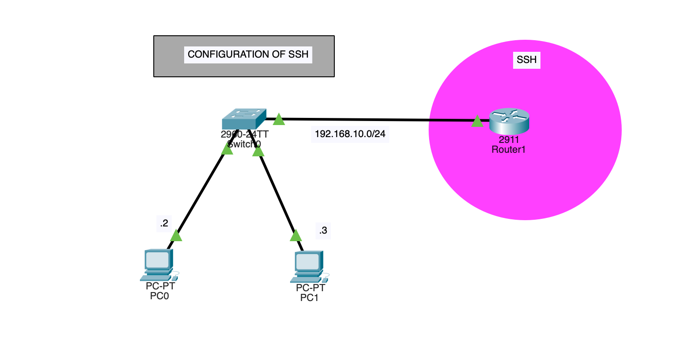

# SSH Configuration on Cisco Router

This project demonstrates how to securely configure **SSH (Secure Shell)** on a Cisco router using Packet Tracer.

The lab focuses on enabling secure remote access using local authentication and RSA encryption keys.

---

## What is SSH?

SSH (Secure Shell) is a secure network protocol used to remotely access and manage network devices.  

Unlike Telnet, SSH:
- Encrypts all communication
- Prevents password sniffing
- Uses secure authentication
- Provides secure remote CLI access

---

## Topology

This lab contains:

- 1 Router (2911)
- 1 Switch (2960)
- 2 PCs
- Network: `192.168.10.0/24`

PCs are used to remotely access the router using SSH.

📂 Topology image available here:  
`docs/topology.png`

---

## Objectives

- Configure hostname
- Configure enable password
- Configure domain name
- Create local username & password
- Generate RSA keys
- Enable SSH version 2
- Restrict VTY lines to SSH only
- Use local database for authentication

---

## Project Structure

SSH-Configuration-Lab/
│
├── README.md
│
├── docs/
│   ├── topology.png
│   └── README.md
│
├── packet-tracer/
│   ├── SSH-Configuration.pkt
│   └── README.md
│
└── configs/
    └── router/
        └── R1-SSH.txt

